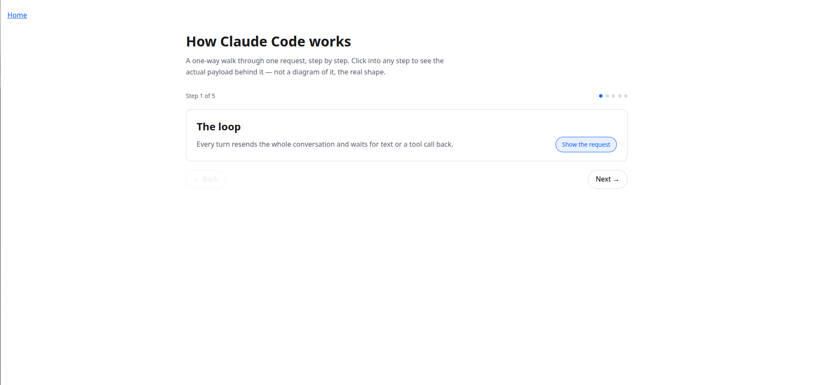
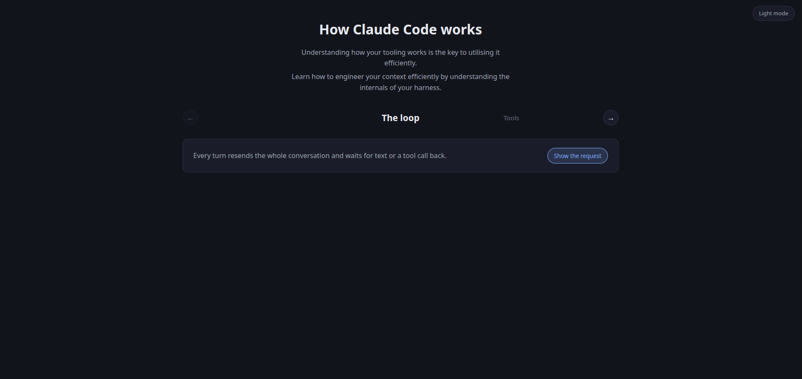
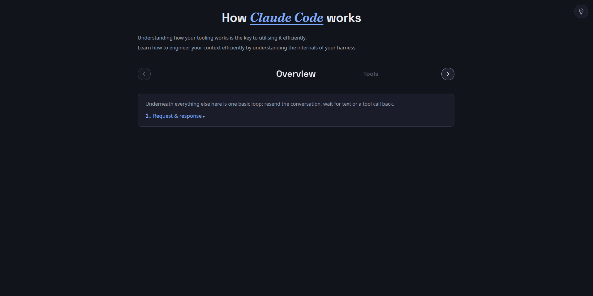
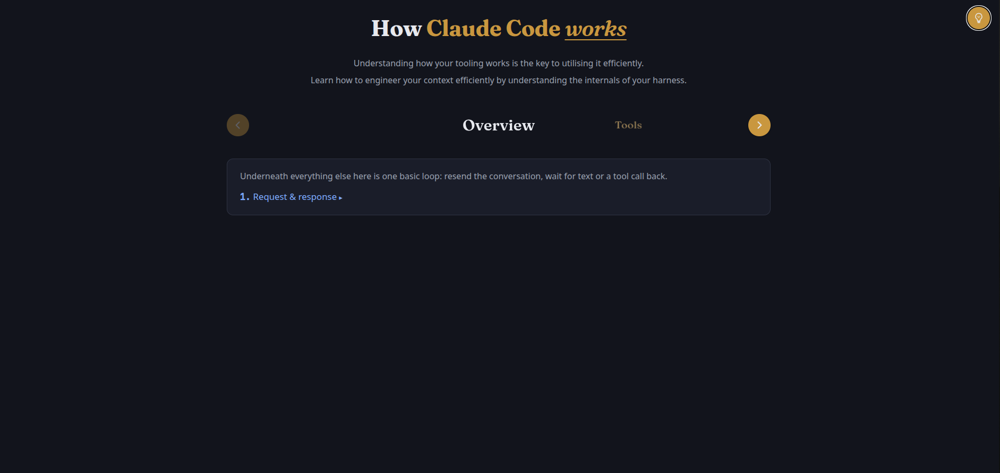
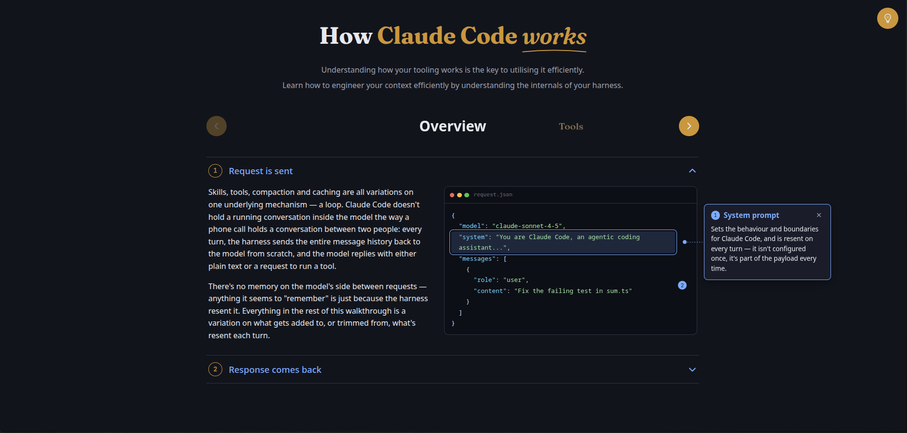

# Process overview

## What I built

I built an interactive explainer of how Claude Code works. The idea behind it is that understanding
how your tooling works is key to using it efficiently, and that to manage your context effectively you
have to understand how your harness populates and interacts with that context. The site has a carousel
to progress through 'steps of understanding'. Each step has multiple sections, each with their own annotated
JSON request/response payload/snippet thereof. The usage of the payload as the illustration tool was deliberate:
under the hood, Claude Code is just making requests using Anthropic's publicly documented API, and understanding how
harness configuration affects those requests is key to using the tool most effectively. Since the site's message is about
using context efficiently, it also has a fun 'context invalidation' mechanism in the UX: as you progress through the site,
the sections and annotations you have expanded/collapsed remain in state; go back to an earlier step and expand/collapse something,
and you invalidate the 'cache' for later stages by shortening the stable prefix, causing the state of those later steps to be lost.
A cache invalidation counter and 'cache wipe' animation is included to visualise this dynamic, and the final step—caching—makes the
connection explicit.

## The moments that mattered

When I had Claude produce the initial prototype, it was clear from the produced design that it
hadn't quite gotten my vision: there were no arrows, instead of 'steps with sections' there was
a single drop down for each step, and generally the layout and placeholder content didn't meet my
expectations. Instead of just telling Claude all of the issues I saw, I gave it my little ASCII art
mockup from the planning phase to help it understand the layout and flow I wanted.
>                How Claude Code Works
>        Understanding how your tooling works is
>        the key to utilising it efficiently.
>
>        Learn how to engineer your context efficiently
>        by understanding the internals of your harness.
>
>                        Overview    Tools       ->
>
>                    (1) Request is sent   --------------
>                                          | {
The first turn with that placeholder changed the design of the protoype from this

to this:

While I still wasn't happy with that design, it incorporated the key elements I was after: centred title
and intro, carousel of steps with subsections. I knew I was on the right track. These changes landed in
[`f3af01f...79247c9`](https://github.com/comp4020-agentic-coding-studio/comp4020-ass1-coreyweir/compare/f3af01f...79247c9)

After a couple of iterations on the prototype, I realised that Claude was unlikely to match my expectations of the design based on my
descriptions alone, so I decided to produce mock-ups. First, I used Gemini to land on the styling for the title and the colour scheme, and
had claude implement that. Then, I used Gemini and ChatGPT to try to mock-up the content formatting and UX, and then refined the mock-ups by
hand using GIMP. By feeding Claude exactly what I wanted the site to look like, and giving it a few prompts to improve things and iterate as I went,
I was able to take the site from this

through this

to this final design:

These changes spanned commits [`0df53c5...2121e8b`](https://github.com/comp4020-agentic-coding-studio/comp4020-ass1-coreyweir/compare/0df53c5...2121e8b).

When I was happy with the UX, had finished my research, and was ready to write the copy for the site, I realised that my prototyping-oriented CLAUDE.md was
no longer fit for purpose. Accordingly, I had an agent help me update it, to give the copy writing agent guidance on:
- what the site was
- what the right tone/detail level was
- what should be covered
- how to treat the placeholder content
- what to do with the research output it would be pointed towards

With the guidance in this CLAUDE.md, Claude was able to produce really solid output on the first iteration.
The CLAUDE.md in question is [here](https://github.com/comp4020-agentic-coding-studio/comp4020-ass1-coreyweir/blob/cf3758d/CLAUDE.md).
The copy was added in [`c04144f`](https://github.com/comp4020-agentic-coding-studio/comp4020-ass1-coreyweir/commit/c04144f8d1c2fe6ab18b4287c673c98c73eb1af5).
